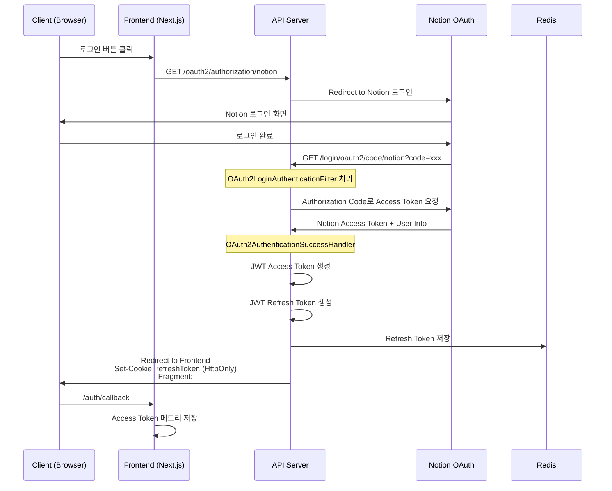
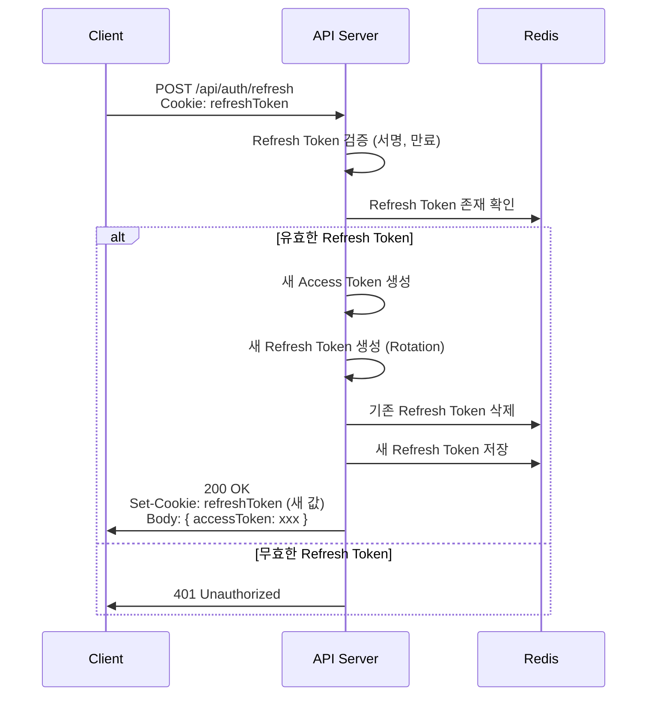
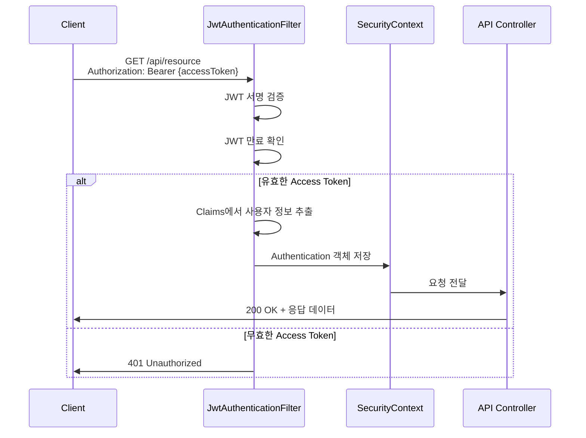
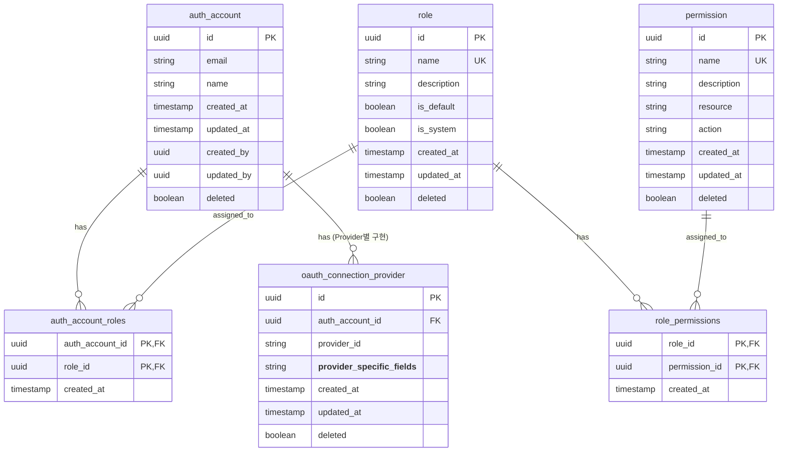

# Authentication & Authorization Specification

> Claude Code 참조용 인증/인가 시스템 구현 스펙

## 1. Overview (개요)

[To be written]

## 2. Architecture (아키텍처)

### 2.1 설계 원칙

| 원칙                              | 설명                                                                     |
| --------------------------------- | ------------------------------------------------------------------------ |
| **Stateless**                     | 서버에 세션 저장 안 함. JWT 자체로 인증 상태 검증                        |
| **Spring Security 아키텍처 보존** | 기본 필터/컴포넌트 최대한 활용. 커스텀은 SuccessHandler, JWT 필터 정도만 |
| **SSOT (Single Source of Truth)** | 인증 로직은 `auth` 모듈에만 존재. 다른 모듈에서 인증 관련 코드 중복 금지 |
| **확장 용이성**                   | OAuth Provider 추가 시 설정만 추가하면 되도록 구조화                     |

### 2.2 인증 플로우

#### OAuth 로그인 → JWT 발급



#### 토큰 갱신 플로우



#### API 요청 인증 플로우



### 2.3 Spring Security 필터 체인 구조

```
┌─────────────────────────────────────────────────────────────┐
│                    SecurityFilterChain                       │
├─────────────────────────────────────────────────────────────┤
│  1. CorsFilter                                               │
│  2. CsrfFilter (disabled for stateless)                     │
│  3. JwtAuthenticationFilter ◀── 커스텀 필터                  │
│  4. OAuth2AuthorizationRequestRedirectFilter                │
│  5. OAuth2LoginAuthenticationFilter                          │
│  6. UsernamePasswordAuthenticationFilter (미사용)            │
│  7. ExceptionTranslationFilter                               │
│  8. AuthorizationFilter                                      │
└─────────────────────────────────────────────────────────────┘
```

**커스텀 컴포넌트:**
- `JwtAuthenticationFilter`: JWT 검증 및 SecurityContext 설정
- `OAuth2AuthenticationSuccessHandler`: JWT 발급 및 리다이렉트 처리
- `OAuth2AuthenticationFailureHandler`: OAuth 실패 시 에러 응답

### 2.4 패키지 구조

```
src/main/java/com/example/
└── auth/
    ├── config/
    │   ├── SecurityConfig.java          # SecurityFilterChain 설정
    │   ├── CorsConfig.java              # CORS 설정
    │   └── RedisConfig.java             # Redis 연결 설정
    ├── jwt/
    │   ├── JwtProvider.java             # JWT 생성/검증 (SSOT)
    │   ├── JwtProperties.java           # JWT 설정값 (secret, expiry 등)
    │   └── JwtAuthenticationFilter.java # 요청마다 JWT 검증
    ├── oauth/
    │   ├── OAuth2AuthenticationSuccessHandler.java
    │   ├── OAuth2AuthenticationFailureHandler.java
    │   ├── CustomOAuth2UserService.java # OAuth 사용자 정보 처리
    │   └── OAuth2UserInfo.java          # Provider별 사용자 정보 추상화
    ├── token/
    │   ├── RefreshTokenService.java     # Refresh Token 관리 (SSOT)
    │   └── TokenBlacklistService.java   # 토큰 블랙리스트 관리
    ├── entity/
    │   ├── AuthAccount.java             # OAuth 연동 계정 정보
    │   └── AuthAccountRepository.java
    └── exception/
        ├── AuthException.java           # 인증 예외 정의
        └── AuthExceptionHandler.java    # 예외 → ErrorResponse 변환
```

### 2.5 핵심 클래스 역할

| 클래스                               | 역할                                     | SSOT 책임                          |
| ------------------------------------ | ---------------------------------------- | ---------------------------------- |
| `JwtProvider`                        | JWT 생성, 파싱, 검증                     | 모든 JWT 관련 로직의 단일 진입점   |
| `RefreshTokenService`                | Refresh Token 저장/조회/삭제/검증        | Redis 기반 토큰 관리의 단일 진입점 |
| `CustomOAuth2UserService`            | OAuth Provider에서 받은 사용자 정보 처리 | OAuth 사용자 정보 → 내부 모델 변환 |
| `OAuth2AuthenticationSuccessHandler` | 로그인 성공 시 JWT 발급 + 리다이렉트     | 로그인 성공 후처리 로직            |
| `JwtAuthenticationFilter`            | 매 요청마다 JWT 검증                     | HTTP 요청의 인증 상태 결정         |
| `TokenBlacklistService`              | 로그아웃된 Access Token 관리             | 토큰 무효화 판단                   |

### 2.6 외부 의존성

#### Redis 역할

| 용도                    | Key 패턴                          | Value            | TTL                           |
| ----------------------- | --------------------------------- | ---------------- | ----------------------------- |
| Refresh Token 저장      | `auth:refresh:{userId}:{tokenId}` | Refresh Token 값 | Refresh Token 만료시간과 동일 |
| Access Token 블랙리스트 | `auth:blacklist:{tokenId}`        | "blacklisted"    | Access Token 남은 만료시간    |

#### Notion OAuth 연동

```yaml
# application.yml
spring:
  security:
    oauth2:
      client:
        registration:
          notion:
            client-id: ${NOTION_CLIENT_ID}
            client-secret: ${NOTION_CLIENT_SECRET}
            authorization-grant-type: authorization_code
            redirect-uri: "{baseUrl}/login/oauth2/code/{registrationId}"
            scope: # Notion은 scope를 별도로 지정하지 않음
        provider:
          notion:
            authorization-uri: https://api.notion.com/v1/oauth/authorize
            token-uri: https://api.notion.com/v1/oauth/token
            user-info-uri: https://api.notion.com/v1/users/me
            user-name-attribute: id
```

### 2.7 확장 고려사항

**OAuth Provider 추가 시 (예: Google):**
1. `application.yml`에 `google` registration 추가
2. `OAuth2UserInfo` 구현체 추가 (Provider별 응답 형식 차이 처리)
3. 기존 코드 수정 없음 (OCP 준수)

**다중 디바이스 지원 시:**
- Redis Key에 `deviceId` 추가: `auth:refresh:{userId}:{deviceId}:{tokenId}`
- `RefreshTokenService`만 수정

## 3. Authentication (인증)

### 3.1 JWT 토큰 구조

#### Access Token Claims

| Claim         | 설명                          | 예시                          |
| ------------- | ----------------------------- | ----------------------------- |
| `sub`         | 사용자 식별자 (authAccountId) | `"uuid-string"`               |
| `roles`       | Role 목록                     | `["ROLE_USER"]`               |
| `permissions` | Permission 목록               | `["user:read", "post:write"]` |
| `iat`         | 발급 시간                     | `1234567890`                  |
| `exp`         | 만료 시간                     | `1234569690`                  |
| `jti`         | 토큰 고유 ID (블랙리스트용)   | `"uuid-v4"`                   |

#### Refresh Token Claims

| Claim | 설명                          | 예시            |
| ----- | ----------------------------- | --------------- |
| `sub` | 사용자 식별자 (authAccountId) | `"uuid-string"` |
| `iat` | 발급 시간                     | `1234567890`    |
| `exp` | 만료 시간                     | `1237159890`    |
| `jti` | 토큰 고유 ID                  | `"uuid-v4"`     |

> **규칙**: Refresh Token에는 `roles`, `permissions`를 포함하지 않음. 갱신 시 DB에서 최신 권한 정보를 조회하여 새 Access Token에 반영.

### 3.2 토큰 만료 시간 설정

| 토큰 유형          | 기본 만료 시간 | 설정 키                                |
| ------------------ | -------------- | -------------------------------------- |
| Access Token       | 30분           | `app.jwt.access-token-expiry`          |
| Refresh Token      | 30일           | `app.jwt.refresh-token-expiry`         |
| Rotation 유예 시간 | 5초            | `app.jwt.refresh-token-rotation-delay` |

**규칙**:
- 모든 시간 설정은 외부 설정 파일(`application.yml`)로 주입
- `JwtProperties` record 클래스로 타입 안전하게 바인딩

### 3.3 Refresh Token Rotation 정책

**목적**: Refresh Token 탈취 시 피해 최소화

**규칙**:
1. `/api/auth/refresh` 호출 시 **항상** 새 Refresh Token 발급
2. 기존 Refresh Token은 `rotation-delay`(기본 5초) 후 무효화
3. 유예 기간 내 동일 토큰으로 재요청 시 정상 처리 (네트워크 지연/재시도 대응)
4. 유예 기간 후 기존 토큰 사용 시 401 Unauthorized

```
Timeline:
────────────────────────────────────────────────────────────────►
     T0                    T0+5s
      │                      │
      ▼                      ▼
  [Refresh 요청]        [기존 토큰 무효화]
  새 토큰 발급           Redis에서 삭제
      │
      └── 유예 기간 ──────┘
          (동시 요청 허용)
```

### 3.4 토큰 발급 규칙

**SSOT 원칙**: 모든 토큰 생성은 `JwtProvider`를 통해서만 수행

**Access Token 발급 시**:
- `authAccountId`와 `roles` 필수
- `jti`(토큰 ID)는 UUID v4로 자동 생성

**Refresh Token 발급 시**:
- `authAccountId`만 필요
- `roles`는 포함하지 않음 (갱신 시 최신 권한 조회)

### 3.5 토큰 검증 규칙

**검증 순서** (순서 반드시 준수):
1. JWT 서명 검증
2. 만료 시간 확인
3. 블랙리스트 확인

**규칙**:
- 검증 실패 시 즉시 예외 발생, 이후 단계 진행하지 않음
- 서명/만료 검증은 JWT 라이브러리에 위임
- 블랙리스트 확인은 Redis 조회

### 3.6 토큰 블랙리스트

**용도**:
| 토큰 유형     | 블랙리스트 등록 시점                    |
| ------------- | --------------------------------------- |
| Access Token  | 로그아웃 시                             |
| Refresh Token | 로그아웃 시, Rotation 유예 기간 종료 시 |

**Redis 키 패턴**:
| 용도            | Key                        | Value           | TTL                |
| --------------- | -------------------------- | --------------- | ------------------ |
| 토큰 블랙리스트 | `auth:blacklist:{tokenId}` | `"blacklisted"` | 토큰 남은 만료시간 |

**규칙**:
- TTL은 토큰의 남은 유효기간과 동일하게 설정 (불필요한 데이터 자동 정리)
- Access/Refresh 구분 없이 동일한 키 패턴 사용 (`jti`가 고유하므로 충돌 없음)

### 3.7 로그아웃 처리

**처리 순서**:
1. Access Token → 블랙리스트 등록
2. Refresh Token → 블랙리스트 등록
3. Redis에서 Refresh Token 삭제
4. 응답에서 Refresh Token Cookie 삭제

**Cookie 삭제 설정**:
| 속성       | 값              |
| ---------- | --------------- |
| `httpOnly` | `true`          |
| `secure`   | `true`          |
| `sameSite` | `Strict`        |
| `path`     | `/`             |
| `maxAge`   | `0` (즉시 만료) |

### 3.8 OAuth 사용자 정보 동기화

**규칙**:
- 매 로그인 시 Notion에서 받은 최신 정보로 `AuthAccount` 업데이트
- 동기화 대상 필드: `name`, `email`, `avatarUrl`
- `provider`, `providerId`는 변경 불가 (식별자)

### 3.9 자동 회원가입 플로우

```
OAuth 로그인:
                                    ┌─────────────────┐
                                    │ Provider+ID로   │
                                    │ AuthAccount 조회│
                                    └────────┬────────┘
                                             │
                         ┌───────────────────┴───────────────────┐
                         │                                       │
                    [존재함]                                 [없음]
                         │                                       │
                         ▼                                       ▼
              ┌──────────────────┐                    ┌──────────────────┐
              │ 프로필 정보 동기화 │                    │ 새 AuthAccount   │
              │ (이름, 이메일 등)  │                    │ 생성 (자동 가입)  │
              └──────────────────┘                    └──────────────────┘
                         │                                       │
                         └───────────────────┬───────────────────┘
                                             │
                                             ▼
                                  ┌──────────────────┐
                                  │ JWT 발급 및      │
                                  │ 로그인 완료       │
                                  └──────────────────┘
```

**신규 사용자 기본값**:
| 필드         | 값                                 |
| ------------ | ---------------------------------- |
| `roles`      | `["ROLE_USER"]`                    |
| `provider`   | OAuth Provider ID (예: `"notion"`) |
| `providerId` | Provider에서 받은 사용자 ID        |

### 3.10 인증 에러 응답

**형식**: Spring 6 `ProblemDetail` 기반 (RFC 7807)

**에러 코드 목록**:
| 코드       | 상황                                | HTTP 상태 |
| ---------- | ----------------------------------- | --------- |
| `AUTH_001` | 유효하지 않은 토큰 (서명 불일치 등) | 401       |
| `AUTH_002` | 만료된 토큰                         | 401       |
| `AUTH_003` | 블랙리스트에 등록된 토큰            | 401       |
| `AUTH_004` | Refresh Token이 Redis에 없음        | 401       |
| `AUTH_005` | OAuth 인증 실패                     | 401       |

### 3.11 JwtAuthenticationFilter 규칙

**처리 흐름**:
1. `Authorization` 헤더에서 `Bearer` 토큰 추출
2. 토큰이 없으면 → 필터 통과 (인증 없이 진행, 이후 인가에서 처리)
3. 토큰이 있으면 → 검증 수행
    - 성공: `SecurityContext`에 `Authentication` 설정
    - 실패: `SecurityContext` 비움 (이후 필터에서 401 처리)

**필터 제외 경로**:
- `/oauth2/**` (OAuth 인증 시작)
- `/login/oauth2/**` (OAuth 콜백)

### 3.12 SecurityContext 설정

**Authentication 객체 구성**:
| 필드          | 값                         |
| ------------- | -------------------------- |
| `principal`   | `authAccountId` (UUID)     |
| `credentials` | `null` (JWT에서는 불필요)  |
| `authorities` | JWT `roles` claim에서 추출 |

**Controller에서 접근**:
- `@AuthenticationPrincipal UUID authAccountId`로 현재 사용자 ID 주입

## 4. Authorization (인가)

### 4.1 권한 체계 구조

**하이브리드 모델**: User → Role → Permission

```
┌─────────────┐      ┌─────────────┐      ┌─────────────┐
│    User     │ ──── │    Role     │ ──── │ Permission  │
│ (AuthAccount)│  N:M │             │  N:M │             │
└─────────────┘      └─────────────┘      └─────────────┘
```

**설계 원칙**:
- Role: 역할 그룹 (예: `ADMIN`, `USER`, `MODERATOR`)
- Permission: 세부 권한 (예: `user:read`, `post:write`, `admin:manage`)
- 사용자는 여러 Role을 가질 수 있음
- Role은 여러 Permission을 가질 수 있음

### 4.2 Role 엔티티 설계

| 필드          | 타입    | 설명                              |
| ------------- | ------- | --------------------------------- |
| `id`          | UUID    | Role 식별자                       |
| `name`        | String  | Role 이름 (예: `ROLE_ADMIN`)      |
| `description` | String  | Role 설명                         |
| `isDefault`   | Boolean | 신규 사용자에게 자동 부여 여부    |
| `isSystem`    | Boolean | 시스템 기본 Role 여부 (삭제 불가) |

**기본 Role 목록**:
| Role         | isDefault | isSystem | 설명        |
| ------------ | --------- | -------- | ----------- |
| `ROLE_USER`  | `true`    | `true`   | 일반 사용자 |
| `ROLE_ADMIN` | `false`   | `true`   | 관리자      |

**규칙**:
- `isSystem=true`인 Role은 삭제/수정 불가
- `isDefault=true`인 Role은 신규 가입 시 자동 부여
- Role 이름은 `ROLE_` 접두사 필수 (Spring Security 규칙)

### 4.3 Permission 엔티티 설계

| 필드          | 타입   | 설명                                      |
| ------------- | ------ | ----------------------------------------- |
| `id`          | UUID   | Permission 식별자                         |
| `name`        | String | Permission 이름 (예: `user:read`)         |
| `description` | String | Permission 설명                           |
| `resource`    | String | 리소스 분류 (예: `user`, `post`)          |
| `action`      | String | 액션 분류 (예: `read`, `write`, `delete`) |

**Permission 네이밍 컨벤션**:
```
{resource}:{action}

예시:
- user:read      → 사용자 정보 조회
- user:write     → 사용자 정보 수정
- post:delete    → 게시물 삭제
- admin:manage   → 관리자 기능 접근
```

### 4.4 Role-Permission 매핑

**관계**: 다대다 (N:M)

| Role         | Permissions                            |
| ------------ | -------------------------------------- |
| `ROLE_USER`  | `user:read`, `post:read`, `post:write` |
| `ROLE_ADMIN` | 모든 Permission                        |

**규칙**:
- Role 변경 시 해당 Role을 가진 모든 사용자에게 즉시 반영
- Permission 추가/삭제는 관리자만 가능

### 4.5 URL 패턴 기반 접근 제어

**SecurityFilterChain 설정 규칙**:

| 우선순위 | 패턴                             | 접근 조건          |
| -------- | -------------------------------- | ------------------ |
| 1        | 공개 API 경로 (외부 설정)        | `permitAll()`      |
| 2        | `/oauth2/**`, `/login/oauth2/**` | `permitAll()`      |
| 3        | `/api/auth/refresh`              | `permitAll()`      |
| 4        | `/api/admin/**`                  | `hasRole('ADMIN')` |
| 5        | `/api/**`                        | `authenticated()`  |
| 6        | 그 외                            | `denyAll()`        |

**공개 API 설정**:
```yaml
# application.yml
app:
  security:
    public-paths:
      - /api/health
      - /api/public/**
      - /api/docs/**
```

**규칙**:
- 공개 API 경로는 외부 설정 파일로 주입
- 패턴 매칭은 위에서 아래로 순차 적용 (첫 매칭 적용)
- 명시되지 않은 경로는 기본적으로 차단 (`denyAll`)

### 4.6 메서드 레벨 보안

**활성화**: `@EnableMethodSecurity` 사용

**사용 가능한 어노테이션**:
| 어노테이션       | 용도                          | 예시                                                                 |
| ---------------- | ----------------------------- | -------------------------------------------------------------------- |
| `@PreAuthorize`  | 메서드 실행 전 권한 검사      | `@PreAuthorize("hasRole('ADMIN')")`                                  |
| `@PostAuthorize` | 메서드 실행 후 결과 기반 검사 | `@PostAuthorize("returnObject.ownerId == authentication.principal")` |
| `@Secured`       | 단순 Role 검사                | `@Secured("ROLE_ADMIN")`                                             |

**규칙**:
- URL 패턴으로 충분한 경우 메서드 레벨 보안 사용 금지 (중복 방지)
- 복잡한 조건 (소유권 검증 등)에만 메서드 레벨 보안 사용
- `@PreAuthorize` 우선 사용 (SpEL 표현식 지원)

### 4.7 공개 API 설정

**설정 방식**: 외부 설정 파일 주입

```yaml
# application.yml
app:
  security:
    public-paths:
      - /api/health
      - /api/public/**
    public-methods:
      - GET:/api/posts         # GET 메서드만 공개
      - GET:/api/posts/{id}
```

**규칙**:
- 경로 패턴: Ant 스타일 (`**`, `*`, `?` 지원)
- 메서드별 제어 필요 시 `{METHOD}:{PATH}` 형식 사용
- 런타임 변경 불가 (애플리케이션 재시작 필요)

### 4.8 소유권 검증 가이드라인

**원칙**: 비즈니스 도메인별로 구현, `auth` 모듈에서 공통 유틸 제공

**공통 패턴**:
```
검증 대상: 리소스의 소유자 == 현재 인증된 사용자
```

**구현 위치**:
| 레이어     | 역할                               |
| ---------- | ---------------------------------- |
| Controller | `@PreAuthorize`로 단순 소유권 검증 |
| Service    | 복잡한 비즈니스 로직과 결합된 검증 |
| Repository | 쿼리 레벨에서 소유권 필터링        |

**SpEL 예시**:
```
@PreAuthorize("#userId == authentication.principal")
@PreAuthorize("@ownershipChecker.isOwner(#resourceId, authentication.principal)")
```

**규칙**:
- 소유권 검증 로직은 각 도메인 모듈에서 구현
- `auth` 모듈은 `authentication.principal` 접근 방법만 제공
- 도메인 구체화 시 상세 정책 결정

### 4.9 권한 변경 플로우

**주체**: 관리자 (`ROLE_ADMIN`)

```
권한 변경 플로우:
┌─────────────┐     ┌─────────────┐     ┌─────────────┐
│   Admin     │────▶│ Role/Perm   │────▶│   User의    │
│   요청      │     │   변경      │     │ 다음 토큰에 │
└─────────────┘     └─────────────┘     │   반영      │
                                        └─────────────┘
```

**Role 부여/회수**:
| 작업              | 조건             | 반영 시점                 |
| ----------------- | ---------------- | ------------------------- |
| Role 부여         | 관리자 권한 필요 | 다음 Access Token 갱신 시 |
| Role 회수         | 관리자 권한 필요 | 다음 Access Token 갱신 시 |
| 즉시 반영 필요 시 | -                | 기존 Refresh Token 무효화 |

**규칙**:
- 권한 변경은 DB에 즉시 반영
- JWT claims는 다음 토큰 갱신 시 반영 (Stateless 유지)
- 긴급 권한 회수 시 해당 사용자의 모든 Refresh Token 무효화

### 4.10 인가 실패 응답

**형식**: Spring 6 `ProblemDetail` 기반 (RFC 7807)

**에러 코드 목록**:
| 코드        | 상황                                      | HTTP 상태 |
| ----------- | ----------------------------------------- | --------- |
| `AUTHZ_001` | 인증되지 않은 사용자의 보호된 리소스 접근 | 401       |
| `AUTHZ_002` | 권한 부족 (Role/Permission 없음)          | 403       |
| `AUTHZ_003` | 리소스 소유권 없음                        | 403       |

**응답 예시**:
```json
{
  "type": "about:blank",
  "title": "Forbidden",
  "status": 403,
  "detail": "해당 리소스에 접근할 권한이 없습니다",
  "instance": "/api/admin/users",
  "properties": {
    "errorCode": "AUTHZ_002",
    "requiredRole": "ROLE_ADMIN"
  }
}
```

### 4.11 권한 조회 로직

**조회 시점**:
| 시점              | 조회 대상       | 소스         |
| ----------------- | --------------- | ------------ |
| Access Token 발급 | Role 목록       | DB           |
| API 요청 인증     | Role 목록       | JWT claims   |
| 메서드 레벨 보안  | Permission 목록 | DB (필요 시) |

**규칙**:
- Role은 JWT claims에서 조회 (DB 조회 없음)
- Permission 검증 필요 시 DB 조회 (캐싱 권장)
- 토큰 갱신 시 DB에서 최신 Role 조회

### 4.12 SpEL 표현식 가이드

**사용 가능한 표현식**:
| 표현식                       | 설명                         | 예시                                        |
| ---------------------------- | ---------------------------- | ------------------------------------------- |
| `hasAuthority('PERM')`       | Permission 보유 확인         | `hasAuthority('user:read')`                 |
| `hasAnyAuthority('P1','P2')` | 여러 Permission 중 하나 보유 | `hasAnyAuthority('user:read','user:write')` |
| `authentication.principal`   | 현재 사용자 ID               | `#userId == authentication.principal`       |
| `@beanName.method()`         | Bean 메서드 호출             | `@permissionEvaluator.check(#id)`           |

**규칙**:
- Permission 기반 검사 사용 (`hasAuthority()`)
- Role 기반 검사(`hasRole()`) 대신 Permission 사용 권장
- 복잡한 로직은 별도 Bean으로 분리

### 4.13 권한 캐싱 전략

**캐싱 대상**:
| 대상                 | 캐싱 여부 | TTL  | 저장소     |
| -------------------- | --------- | ---- | ---------- |
| Role 목록            | X         | -    | JWT claims |
| Permission 목록      | O         | 5분  | 로컬 캐시  |
| Role-Permission 매핑 | O         | 10분 | 로컬 캐시  |

**규칙**:
- Role은 JWT에 포함되므로 별도 캐싱 불필요
- Permission은 DB 조회 빈도가 높을 경우 캐싱
- 권한 변경 시 관련 캐시 무효화

**캐시 무효화 이벤트**:
- Role 수정/삭제
- Permission 수정/삭제
- Role-Permission 매핑 변경

### 4.14 Permission 기반 권한 검사

**설계 원칙**: Role Hierarchy 대신 Permission 기반 검사

**권한 해결 흐름**:
```
User → Role(s) → Permission(s) → 권한 검사
```

**JWT Claims에 포함되는 정보**:
| 항목          | 포함 여부 | 설명                            |
| ------------- | --------- | ------------------------------- |
| `roles`       | O         | 사용자의 Role 목록              |
| `permissions` | O         | Role에서 파생된 Permission 목록 |

**권한 검사 방식**:
```
@PreAuthorize("hasAuthority('user:read')")
@PreAuthorize("hasAnyAuthority('user:read', 'user:write')")
```

**규칙**:
- `hasRole()` 대신 `hasAuthority()` 사용 권장
- Permission은 `{resource}:{action}` 형식
- Role은 그룹핑 용도로만 사용, 실제 검사는 Permission으로 수행

## 5. Entities & Storage (엔티티 및 저장소)

### 5.1 ER 다이어그램



> **Note**: `oauth_connection_provider`는 Provider별로 별도 테이블로 구현 (예: `notion_connection`, `google_connection`)

### 5.2 공통 베이스 엔티티

**감사 필드 (Auditable)**:
| 필드         | 타입      | 설명                    | 자동 설정            |
| ------------ | --------- | ----------------------- | -------------------- |
| `created_at` | TIMESTAMP | 생성 시간               | INSERT 시            |
| `updated_at` | TIMESTAMP | 수정 시간 (삭제 시간)   | UPDATE/DELETE 시     |
| `created_by` | UUID      | 생성자 ID               | INSERT 시 (nullable) |
| `updated_by` | UUID      | 수정자 ID               | UPDATE 시 (nullable) |
| `deleted`    | BOOLEAN   | 삭제 여부 (Soft Delete) | DELETE 시 true       |

**규칙**:
- 모든 엔티티는 감사 필드 포함
- `created_by`, `updated_by`는 시스템 작업 시 null 허용
- `deleted = true`이면 삭제된 데이터, 삭제 시간은 `updated_at` 참조

### 5.3 AuthAccount 엔티티

**테이블명**: `auth_account`

| 컬럼         | 타입         | 제약조건                | 설명                       |
| ------------ | ------------ | ----------------------- | -------------------------- |
| `id`         | UUID         | PK, NOT NULL            | 계정 식별자                |
| `email`      | VARCHAR(255) | UNIQUE, NULL            | 이메일 (OAuth에서 제공 시) |
| `name`       | VARCHAR(100) | NOT NULL                | 사용자 이름                |
| `created_at` | TIMESTAMP    | NOT NULL                | 생성 시간                  |
| `updated_at` | TIMESTAMP    | NOT NULL                | 수정 시간 (삭제 시간)      |
| `created_by` | UUID         | NULL                    | 생성자                     |
| `updated_by` | UUID         | NULL                    | 수정자                     |
| `deleted`    | BOOLEAN      | NOT NULL, DEFAULT false | 삭제 여부                  |

**규칙**:
- `email`은 OAuth Provider마다 제공 여부가 다르므로 nullable
- `name`은 OAuth에서 제공하는 표시 이름 사용
- 다중 OAuth 연동을 위해 Provider 정보는 별도 테이블로 분리

### 5.4 OAuth 연동 엔티티 가이드라인

**설계 원칙**: Provider별로 제공하는 정보가 다르므로, 각 Provider별 엔티티를 별도 정의

**공통 요구사항**:
- `AuthAccount`와 N:1 관계 (한 계정에 여러 Provider 연동 가능)
- Provider 내 사용자 식별자 (`provider_id`) 필수
- 동일 Provider의 동일 사용자 중복 방지 (UNIQUE 제약)

**예시 구조**:
```
AuthAccount (1) ──── (N) NotionConnection
AuthAccount (1) ──── (N) GoogleConnection
```

**Provider별 엔티티 정의 시 포함 필드**:
| 필드               | 필수 여부 | 설명                                  |
| ------------------ | --------- | ------------------------------------- |
| `id`               | 필수      | 연동 식별자 (UUID)                    |
| `auth_account_id`  | 필수      | AuthAccount FK                        |
| `provider_id`      | 필수      | Provider 내 사용자 ID                 |
| Provider 특화 필드 | 선택      | 각 Provider API에서 필요한 정보       |
| 감사 필드          | 필수      | `created_at`, `updated_at`, `deleted` |

**규칙**:
- 각 Provider 엔티티는 해당 도메인 구현 시 상세 정의
- `access_token` 저장 시 암호화 필수
- 한 계정에 동일 Provider 중복 연동 방지

### 5.5 Role 엔티티

**테이블명**: `role`

| 컬럼          | 타입         | 제약조건                | 설명                  |
| ------------- | ------------ | ----------------------- | --------------------- |
| `id`          | UUID         | PK, NOT NULL            | Role 식별자           |
| `name`        | VARCHAR(50)  | UNIQUE, NOT NULL        | Role 이름             |
| `description` | VARCHAR(255) | NULL                    | Role 설명             |
| `is_default`  | BOOLEAN      | NOT NULL, DEFAULT false | 기본 부여 여부        |
| `is_system`   | BOOLEAN      | NOT NULL, DEFAULT false | 시스템 Role 여부      |
| `created_at`  | TIMESTAMP    | NOT NULL                | 생성 시간             |
| `updated_at`  | TIMESTAMP    | NOT NULL                | 수정 시간 (삭제 시간) |
| `deleted`     | BOOLEAN      | NOT NULL, DEFAULT false | 삭제 여부             |

**초기 데이터**:
```sql
INSERT INTO role (id, name, description, is_default, is_system)
VALUES
  (gen_random_uuid(), 'ROLE_USER', '일반 사용자', true, true),
  (gen_random_uuid(), 'ROLE_ADMIN', '관리자', false, true);
```

### 5.6 Permission 엔티티

**테이블명**: `permission`

| 컬럼          | 타입         | 제약조건                | 설명                  |
| ------------- | ------------ | ----------------------- | --------------------- |
| `id`          | UUID         | PK, NOT NULL            | Permission 식별자     |
| `name`        | VARCHAR(100) | UNIQUE, NOT NULL        | Permission 이름       |
| `description` | VARCHAR(255) | NULL                    | Permission 설명       |
| `resource`    | VARCHAR(50)  | NOT NULL                | 리소스 분류           |
| `action`      | VARCHAR(50)  | NOT NULL                | 액션 분류             |
| `created_at`  | TIMESTAMP    | NOT NULL                | 생성 시간             |
| `updated_at`  | TIMESTAMP    | NOT NULL                | 수정 시간 (삭제 시간) |
| `deleted`     | BOOLEAN      | NOT NULL, DEFAULT false | 삭제 여부             |

**제약조건**:
- UNIQUE: `(resource, action)` - 리소스+액션 조합 중복 방지

### 5.7 중간 테이블 설계

#### auth_account_roles

| 컬럼              | 타입      | 제약조건 | 설명      |
| ----------------- | --------- | -------- | --------- |
| `auth_account_id` | UUID      | PK, FK   | 계정 참조 |
| `role_id`         | UUID      | PK, FK   | Role 참조 |
| `created_at`      | TIMESTAMP | NOT NULL | 부여 시간 |

#### role_permissions

| 컬럼            | 타입      | 제약조건 | 설명            |
| --------------- | --------- | -------- | --------------- |
| `role_id`       | UUID      | PK, FK   | Role 참조       |
| `permission_id` | UUID      | PK, FK   | Permission 참조 |
| `created_at`    | TIMESTAMP | NOT NULL | 매핑 시간       |

**규칙**:
- 중간 테이블은 Soft Delete 미적용 (연결 해제 시 물리 삭제)
- `created_at`만 포함 (수정 개념 없음)

### 5.8 Soft Delete 정책

**적용 대상**: 모든 주요 엔티티 (중간 테이블 제외)

**구현 방식**: Hibernate 6 `@SoftDelete` 어노테이션

```
@SoftDelete
```

**동작 방식**:
| 작업   | 실제 동작                              |
| ------ | -------------------------------------- |
| DELETE | `deleted = true`, `updated_at = NOW()` |
| SELECT | `WHERE deleted = false` 조건 자동 추가 |
| 복구   | `deleted = false` 설정                 |

**컬럼 구성**:
| 컬럼         | 타입      | 설명                      |
| ------------ | --------- | ------------------------- |
| `deleted`    | BOOLEAN   | 삭제 여부 (DEFAULT false) |
| `updated_at` | TIMESTAMP | 삭제 시간으로 활용        |

**규칙**:
- 삭제 시간은 `updated_at` 컬럼으로 대체 (별도 `deleted_at` 컬럼 불필요)
- 삭제된 데이터는 기본 조회에서 제외
- 관리자 기능에서 삭제된 데이터 조회 필요 시 Native Query 사용

### 5.9 UUID 생성 전략

**생성 방식**: PostgreSQL `gen_random_uuid()` (UUID v4)

**JPA 설정**:
```
@Id
@GeneratedValue(strategy = GenerationType.UUID)
private UUID id;
```

**규칙**:
- 애플리케이션이 아닌 DB에서 UUID 생성
- UUID v4 (랜덤) 사용
- 외부 노출 시 UUID 문자열 형식 사용

### 5.10 인덱스 설계

**auth_account**:
| 인덱스                     | 컬럼      | 용도               |
| -------------------------- | --------- | ------------------ |
| `idx_auth_account_email`   | `email`   | 이메일로 조회      |
| `idx_auth_account_deleted` | `deleted` | Soft Delete 필터링 |

**oauth_connection**:
| 인덱스                   | 컬럼                      | 용도                  |
| ------------------------ | ------------------------- | --------------------- |
| `uk_oauth_provider_id`   | `(provider, provider_id)` | OAuth 로그인 시 조회  |
| `idx_oauth_auth_account` | `auth_account_id`         | 계정별 연동 목록 조회 |

**role**:
| 인덱스                | 컬럼         | 용도           |
| --------------------- | ------------ | -------------- |
| `idx_role_is_default` | `is_default` | 기본 Role 조회 |

**permission**:
| 인덱스                    | 컬럼       | 용도               |
| ------------------------- | ---------- | ------------------ |
| `idx_permission_resource` | `resource` | 리소스별 권한 조회 |

### 5.11 테이블 네이밍 컨벤션

| 항목     | 규칙                  | 예시                            |
| -------- | --------------------- | ------------------------------- |
| 테이블명 | snake_case, 단수형    | `auth_account`, `role`          |
| 컬럼명   | snake_case            | `created_at`, `auth_account_id` |
| PK       | `id`                  | `id`                            |
| FK       | `{참조테이블}_id`     | `auth_account_id`, `role_id`    |
| 인덱스   | `idx_{테이블}_{컬럼}` | `idx_auth_account_email`        |
| Unique   | `uk_{테이블}_{컬럼}`  | `uk_oauth_provider_id`          |

### 5.12 컬럼 제약조건 규칙

| 제약조건   | 적용 기준                                             |
| ---------- | ----------------------------------------------------- |
| `NOT NULL` | 필수 필드, 비즈니스 로직상 항상 값이 있어야 하는 경우 |
| `UNIQUE`   | 중복 불허 필드 (email, name 등)                       |
| `DEFAULT`  | 기본값이 명확한 경우 (boolean, timestamp 등)          |
| `CHECK`    | 값 범위/형식 제한 필요 시                             |

**Soft Delete와 UNIQUE 처리**:
```sql
-- Partial Unique Index (삭제되지 않은 데이터에만 적용)
CREATE UNIQUE INDEX uk_auth_account_email
ON auth_account (email)
WHERE deleted = false;
```

### 5.13 Redis 스키마

| 용도                 | Key 패턴                          | Value                  | TTL                |
| -------------------- | --------------------------------- | ---------------------- | ------------------ |
| Refresh Token        | `auth:refresh:{userId}:{tokenId}` | Token 값               | 30일               |
| 토큰 블랙리스트      | `auth:blacklist:{tokenId}`        | `"blacklisted"`        | 토큰 남은 만료시간 |
| Permission 캐시      | `auth:permission:{roleId}`        | Permission 목록 (JSON) | 5분                |
| Role-Permission 캐시 | `auth:role-perm:{roleId}`         | Permission ID 목록     | 10분               |

**규칙**:
- 모든 키는 `auth:` 접두사 사용 (네임스페이스)
- TTL은 용도에 맞게 설정
- 캐시 무효화 시 관련 키 패턴으로 삭제

### 5.14 마이그레이션 전략

**도구**: Flyway

**파일 네이밍**:
```
V{버전}__{설명}.sql

예시:
V1__create_auth_tables.sql
V2__add_oauth_connection.sql
V3__add_permission_tables.sql
```

**규칙**:
- 버전은 순차 증가 (V1, V2, V3...)
- 한 번 적용된 마이그레이션은 수정 금지
- 롤백이 필요하면 새 마이그레이션으로 처리
- 개발 환경에서만 `flyway.clean` 허용

## 6. Security Configuration (보안 설정)

### 6.1 SecurityFilterChain 기본 설정

**핵심 설정**:
| 설정 항목          | 값          | 설명                      |
| ------------------ | ----------- | ------------------------- |
| Session Management | `STATELESS` | 서버에 세션 저장 안 함    |
| CSRF               | `disabled`  | Stateless 환경에서 불필요 |
| Form Login         | `disabled`  | OAuth2 로그인만 사용      |
| HTTP Basic         | `disabled`  | 사용 안 함                |

**필터 체인 순서**:
```
1. CorsFilter
2. JwtAuthenticationFilter (커스텀) ← UsernamePasswordAuthenticationFilter 이전
3. OAuth2AuthorizationRequestRedirectFilter
4. OAuth2LoginAuthenticationFilter
5. ExceptionTranslationFilter
6. AuthorizationFilter
```

**규칙**:
- `JwtAuthenticationFilter`는 `UsernamePasswordAuthenticationFilter.class` 이전에 등록
- OAuth2 관련 필터는 Spring Security 기본 설정 유지

### 6.2 CORS 설정

**설정 방식**: 외부 설정 파일 주입

```yaml
# application.yml
app:
  security:
    cors:
      allowed-origins:
        - ${CORS_ALLOWED_ORIGIN:http://localhost:3000}
      allowed-methods:
        - GET
        - POST
        - PUT
        - DELETE
        - PATCH
        - OPTIONS
      allowed-headers:
        - "*"
      allow-credentials: true
      max-age: 3600
```

**규칙**:
| 항목               | 설정        | 설명                            |
| ------------------ | ----------- | ------------------------------- |
| `allowedOrigins`   | 외부 설정   | 환경별로 다르게 설정            |
| `allowCredentials` | `true`      | Cookie(Refresh Token) 전송 허용 |
| `allowedMethods`   | 명시적 지정 | 필요한 HTTP 메서드만 허용       |
| `maxAge`           | 3600초      | Preflight 캐시 시간             |

### 6.3 JWT Filter 설정

**제외 경로** (JWT 검증 생략):
| 경로 패턴          | 설명               |
| ------------------ | ------------------ |
| `/oauth2/**`       | OAuth 인증 시작    |
| `/login/oauth2/**` | OAuth 콜백         |
| 공개 API 경로      | 외부 설정에서 정의 |

**처리 규칙**:
- Authorization 헤더 없음 → 필터 통과 (SecurityContext 비움)
- Authorization 헤더 있음 → JWT 검증 수행
- 검증 실패 → SecurityContext 비움, 이후 AuthorizationFilter에서 401 처리

### 6.4 OAuth2 Login 설정

**커스텀 핸들러 연결**:
| 핸들러                               | 역할                      |
| ------------------------------------ | ------------------------- |
| `OAuth2AuthenticationSuccessHandler` | JWT 발급, Redirect 처리   |
| `OAuth2AuthenticationFailureHandler` | 에러 응답 (ProblemDetail) |
| `CustomOAuth2UserService`            | OAuth 사용자 정보 처리    |

**규칙**:
- `oauth2Login()` 설정에서 커스텀 핸들러 등록
- `userInfoEndpoint()`에 `CustomOAuth2UserService` 등록

### 6.5 URL 패턴별 접근 제어

**규칙 우선순위** (위에서 아래로 적용):

| 순서 | 패턴                 | 접근 조건          | 설명        |
| ---- | -------------------- | ------------------ | ----------- |
| 1    | 공개 API (외부 설정) | `permitAll()`      | 인증 불필요 |
| 2    | `/oauth2/**`         | `permitAll()`      | OAuth 시작  |
| 3    | `/login/oauth2/**`   | `permitAll()`      | OAuth 콜백  |
| 4    | `/api/auth/refresh`  | `permitAll()`      | 토큰 갱신   |
| 5    | `/api/admin/**`      | `hasRole('ADMIN')` | 관리자 전용 |
| 6    | `/api/**`            | `authenticated()`  | 인증 필요   |
| 7    | 그 외                | `denyAll()`        | 기본 차단   |

**규칙**:
- 구체적인 경로가 먼저 매칭되도록 순서 배치
- 명시되지 않은 경로는 기본 차단

### 6.6 보안 헤더 설정

**Spring Security 기본값 사용**:

| 헤더                        | 기본값                          | 설명                                  |
| --------------------------- | ------------------------------- | ------------------------------------- |
| `X-Content-Type-Options`    | `nosniff`                       | MIME 스니핑 방지                      |
| `X-Frame-Options`           | `DENY`                          | Clickjacking 방지                     |
| `X-XSS-Protection`          | `0`                             | 브라우저 XSS 필터 비활성화 (CSP 권장) |
| `Cache-Control`             | `no-cache, no-store, max-age=0` | 보안 응답 캐시 방지                   |
| `Strict-Transport-Security` | HTTPS 환경에서 자동             | HSTS 활성화                           |

**규칙**:
- Spring Security 기본 헤더 설정 유지 (`headers().defaults()`)
- 추가 커스터마이징 필요 시 명시적으로 설정

### 6.7 예외 처리 핸들러

**AuthenticationEntryPoint** (인증 실패):

| 상황            | HTTP 상태 | 에러 코드  |
| --------------- | --------- | ---------- |
| 인증 정보 없음  | 401       | `AUTH_001` |
| 토큰 만료       | 401       | `AUTH_002` |
| 토큰 블랙리스트 | 401       | `AUTH_003` |

**AccessDeniedHandler** (인가 실패):

| 상황        | HTTP 상태 | 에러 코드   |
| ----------- | --------- | ----------- |
| 권한 부족   | 403       | `AUTHZ_002` |
| 소유권 없음 | 403       | `AUTHZ_003` |

**응답 형식**: RFC 7807 ProblemDetail

```json
{
  "type": "about:blank",
  "title": "Unauthorized",
  "status": 401,
  "detail": "인증이 필요합니다",
  "instance": "/api/protected-resource",
  "properties": {
    "errorCode": "AUTH_001"
  }
}
```

### 6.8 PasswordEncoder 설정

**사용 알고리즘**: BCrypt

**Bean 등록**:
```
@Bean
PasswordEncoder passwordEncoder() {
    return new BCryptPasswordEncoder();
}
```

**용도**:
| 대상                    | 용도                                  |
| ----------------------- | ------------------------------------- |
| OAuth Access Token 저장 | Provider에서 받은 토큰 해싱 (필요 시) |
| Refresh Token 저장      | Redis 저장 시 해싱 (선택)             |

**규칙**:
- 민감 정보 저장 시 BCrypt 해싱 적용
- 검증은 `PasswordEncoder.matches()` 사용

### 6.9 Permission 기반 인가 설정

**설계 원칙**: Role Hierarchy 대신 Permission 기반 권한 검사

**GrantedAuthority 구성**:
- JWT에서 `permissions` claim 추출
- 각 Permission을 `GrantedAuthority`로 변환
- `SecurityContext`에 저장

**권한 검사 방식**:
| 방식                | 사용                    | 예시                                        |
| ------------------- | ----------------------- | ------------------------------------------- |
| `hasAuthority()`    | Permission 검사         | `hasAuthority('user:read')`                 |
| `hasAnyAuthority()` | 여러 Permission 중 하나 | `hasAnyAuthority('user:read','user:write')` |
| `hasRole()`         | 미사용 권장             | -                                           |

**규칙**:
- Role은 Permission 그룹핑 용도로만 사용
- 실제 권한 검사는 Permission 기반으로 수행
- Role Hierarchy는 사용하지 않음 (Permission으로 세밀한 제어)

### 6.10 Method Security 활성화

**설정**: `@EnableMethodSecurity`

**활성화 옵션**:
| 옵션             | 값            | 설명                                   |
| ---------------- | ------------- | -------------------------------------- |
| `prePostEnabled` | `true` (기본) | `@PreAuthorize`, `@PostAuthorize` 사용 |
| `securedEnabled` | `false`       | `@Secured` 미사용                      |
| `jsr250Enabled`  | `false`       | `@RolesAllowed` 미사용                 |

**규칙**:
- `@PreAuthorize`만 사용 (SpEL 표현식 지원)
- URL 패턴으로 충분한 경우 메서드 보안 사용 금지

### 6.11 환경별 설정 분리

**dev 환경**:
| 설정         | 값                   | 설명               |
| ------------ | -------------------- | ------------------ |
| CORS Origins | `http://localhost:*` | 로컬 개발 허용     |
| 보안 헤더    | 기본값               | 변경 없음          |
| 디버그 로깅  | 활성화               | Security 필터 로깅 |

**prod 환경**:
| 설정         | 값            | 설명         |
| ------------ | ------------- | ------------ |
| CORS Origins | 실제 도메인만 | 명시적 허용  |
| 보안 헤더    | 기본값        | 변경 없음    |
| 디버그 로깅  | 비활성화      | 성능 및 보안 |

**설정 파일 구조**:
```
application.yml           # 공통 설정
application-dev.yml       # 개발 환경
application-prod.yml      # 운영 환경
```

### 6.12 보안 설정 Properties

**외부 주입 가능한 설정 목록**:

```yaml
app:
  jwt:
    secret: ${JWT_SECRET}                    # JWT 서명 키
    access-token-expiry: 30m                 # Access Token 만료
    refresh-token-expiry: 30d                # Refresh Token 만료
    refresh-token-rotation-delay: 5s         # Rotation 유예 시간

  security:
    cors:
      allowed-origins: []                    # CORS 허용 Origin
      allow-credentials: true
      max-age: 3600

    public-paths:                            # 공개 API 경로
      - /api/health
      - /api/public/**
```

**규칙**:
- 민감 정보(`secret`)는 환경 변수로 주입
- 시간 값은 Duration 형식 (`30m`, `30d`, `5s`)
- 목록은 배열 형식으로 정의
